# 驱动使用说明

## 文件更改履历表

| 版本   | 更改说明    | 更改人 | 更改日期   |
| ------ | ----------- | ------ | ---------- |
| V0.4   | 初版        | 吴其荣 | 2023-04-10 |
| V0.4.1 | 更新udp文档 | 吴其荣 | 2023-04-18 |
| V0.4.2 | 更新环境准备文档 | 张小镛 | 2023-08-16 |

## 0-ROS环境准备

参考`ROS官网`教程及其他网络资料。

- `ROS官网` : `http://wiki.ros.org/ROS/Installation`
- 仅支持：`ros-melodic` 及以上版本 （`Ubuntu18.04及以上`）

注意：`ROS驱动` 依赖一些外部 `ROS包` ，基础的 `ros-base` 版本缺失这些依赖项，所有推荐直接安装 `desktop-full` 版本的。（当然也可以安装 `ros-base` 版本后再安装依赖）

ROS环境准备参考流程：
1.  在Ubuntu官网下载ubuntu-18.04.6-desktop-amd64.iso镜像文件
2.  在VMWare软件中新建Ubuntu18.4版本虚拟机 推荐配置：内存选择8G 硬盘100G 
3.  检查是否能访问外网  终端输入：ping www.baidu.com （不能连接外网可以尝试将虚拟机->设置—->网络连接 修改为桥接模式并重启虚拟机）
4.  添加清华的镜像源  终端输入：sudo sh -c '. /etc/lsb-release && echo "deb http://mirrors.tuna.tsinghua.edu.cn/ros/ubuntu/ `lsb_release -cs` main" > /etc/apt/sources.list.d/ros-latest.list'
5.  设置密钥  终端输入：sudo apt-key adv --keyserver 'hkp://keyserver.ubuntu.com:80' --recv-key C1CF6E31E6BADE8868B172B4F42ED6FBAB17C654
6.  确保包索引是最新的  终端输入：sudo apt-get update
7.  安装ROS桌面完整版  终端输入：sudo apt-get install ros-melodic-desktop-full
8.  设置环境变量  终端输入：
    echo "source /opt/ros/melodic/setup.bash" >> ~/.bashrc
    source ~/.bashrc
9.  测试环境是否搭建成功  终端输入：roscore

ROS驱动编译流程请参照：3-运行ros包

## 1-CGI ROS驱动作用

`ROS驱动` 实际上是一个 `ROS程序包`，该程序包作用为：

1. 获取 `CGI设备` 通过 `TCP/串口` 输出的混合协议数据（华测CGI系列自定义协议，NMEA协议），对混合数据进行分类，并把每条协议发布到各自的 `ROS话题中` 供其他ROS程序处理。
2. 对解析得到的 `nmea` 协议进行异或校验，校验通过后发布到 `nmea_sentence` 话题中。
3. 对华测自定义协议中的 `HCINSPVATZCB` 二进制协议进行处理，并发布到 `devpvt` 话题中。
4. 对华测自定义协议中的 `HCRAWIMUIB` 二进制协议进行处理，并发布到 `devimu` 话题中。
5. 可通过串口 `CGI设备` 与 `ntrip服务器`， 以在 `CGI设备无网络` 的情况下接入差分数据完成固定。


## 2-CGI设备设置

`ROS驱动` 目前支持基于 `串口` 以及 `tcp`  的 `华测协议数据源` 的解析处理。

- `华测协议数据源` ：指混合了 `CGI系列华测自定义协议（short header、与 header）` 以及 `以 $ 开头 *xor 校验结尾的 NMEA 协议`。只要输入的数据中包含了任一 `CGI系列华测自定义协议` 或 `NMEA协议` 的内容，都会被解析出并发布到对应话题中。

各个协议类型与 `ROS话题` 对应的关系表如下：

|                             协议                             |      话题       |
| :----------------------------------------------------------: | :-------------: |
|  `NMEA`（`GGA`、`CHC`、`RMC` 等 $ 开头异或校验结尾的数据）   | `nmea_sentence` |
| `华测 CGI 系列自定义协议（header）`（`HCRAWIMUB`、`HCINSPVATB`、`HCINSPVATZCB` 等） |  `hc_sentence`  |
|                        `HCINSPVATZCB`                        |    `devpvt`     |
|                         `HCRAWIMUB`                          |    `devimu`     |

`ROS驱动` 获取到所需的协议数据后便会把解析后的内容发布到对应的话题中。其中：

- `nmea_sentence`: 中为 `NMEA字符串（包含末尾异或校验位，不包含 \r\n）`。话题数据**通过**异或校验。
- `hc_sentence`: 中为 `CGI自定义协议` 二进制串。**未通过** `CRC32校验`。
- `devpvt`: 中为 `HCINSPVATZCB` 二进制串转换成 `ros msg` 后的内容，**通过** `CRC32校验`
- `devimu`: 中为 `HCRAWIMUB` 二进制串转换成 `ros msg` 后的内容，**通过** `CRC32校验`

因此，要使用 `ROS驱动` ，需要对 `CGI设备` 做相应的配置，使其输出 `ROS驱动` 所需的数据。


### 2.1-串口设置

1. 首先连接 `CGI设备` 热点。
2. 进入页面`惯导->选择配置`，在 `串口C设置` 中选择需要开启的协议。

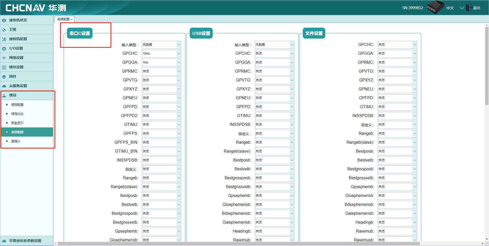

由于串口的带宽很有限，不需要的协议关闭，如需要多条协议，计算串口带宽与协议频率关系后是当选择协议输出频率。

```shell
# 以460800波特率为例
# 每秒最大输出 460800/10=46080B/s (字节每秒)
```

3. 运行 `ros demo` 推荐协议配置如下，开启 `HCINSPVATZCB-10HZ`, `GPCHC-10HZ`, `GPGGA-1HZ`；`输入类型-无数据`；其余全部关闭。

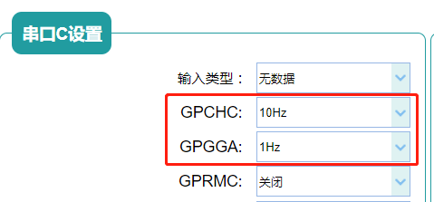

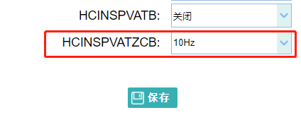

注：`ros功能包` 可以处理高频率的数据输入，如需要更高频率协议输出可以修改频率，但串口的带宽及缓冲区有限，如果 `串口C` 设置的协议总输出带宽大于串口波特率最大带宽，则会造成数据延时现象（接收到的数据是几秒之前的数据内容）。串口带宽与波特率相关，请合理计算并设置。


### 2.2-tcp端口设置

1. 首先连接 `CGI设备` 热点。

2. 进入页面`I/O设置->I/O设置`，在 `TCP Server/NTRIP Caster4` 中选择需要开启的协议

   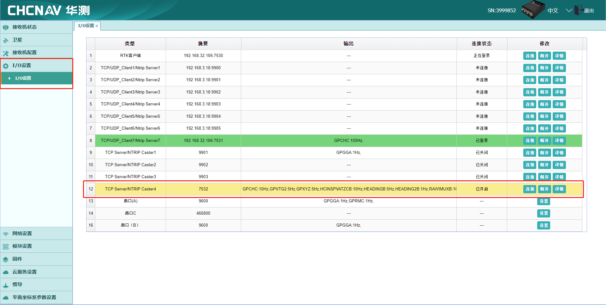

3. 运行 `ros demo` 推荐协议配置如下，开启 `HCINSPVATZCB-10HZ`, `GPCHC-10HZ`, `GPGGA-1HZ`；`输入类型-无数据`；其余全部关闭。

   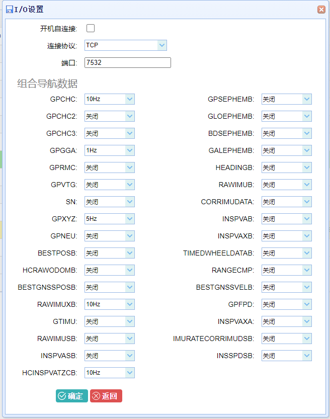

### 2.3-udp端口设置

1. 首先连接 `CGI设备` 热点。

2. 进入页面`I/O设置->I/O设置`，在 `TCP/UDP_Client/NTRIP Server 7 ` 中选择需要开启的协议

   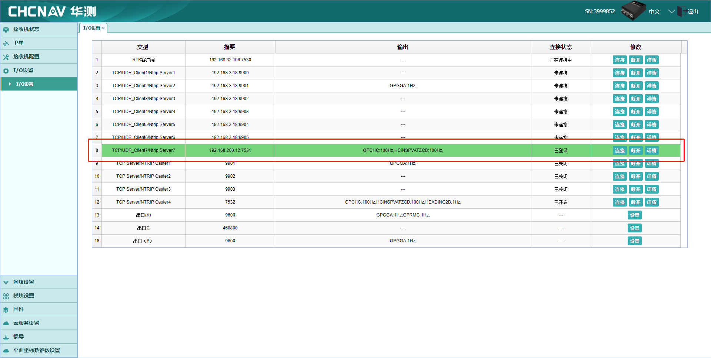

3. 运行 `ros demo` 推荐协议配置如下，开启 `HCINSPVATZCB-10HZ`, `GPCHC-10HZ`, `GPGGA-1HZ`；`输入类型-无数据`；其余全部关闭。

   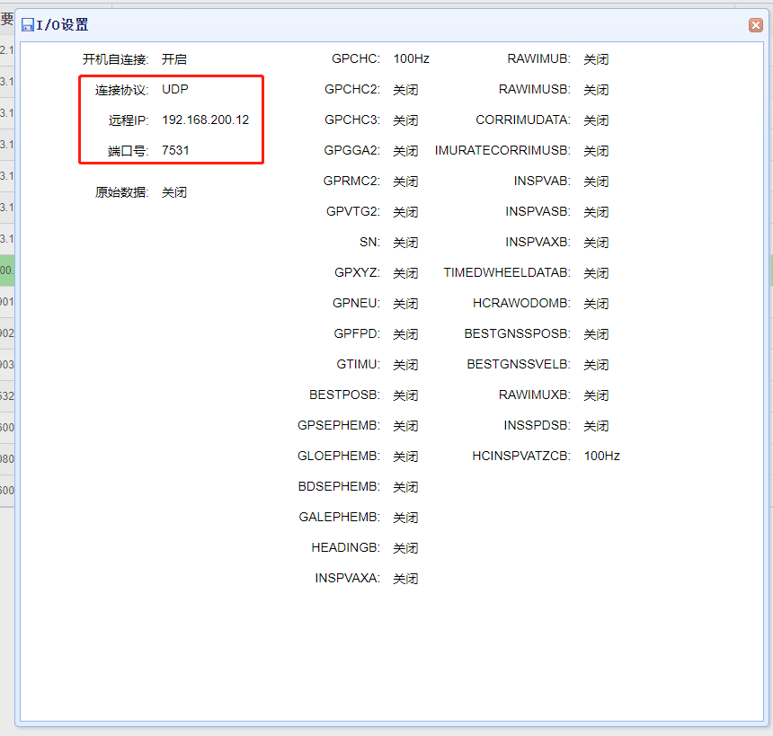

4. 其中，端口号随意填写，`ROS PC 机器` 连接 `CGI设备` 热点后，查看IP地址，并将 `PC机器` 的IP地址填充到此处。

   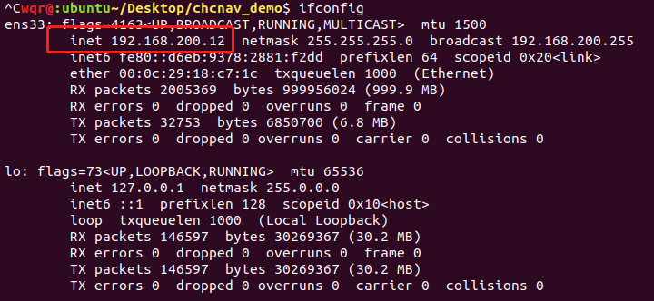

   

## 3-运行ros包

```shell
# 1.建立项目目录并进入
mkdir chcnav_demo && cd chcnav_demo
mkdir src

# 2.将压缩包内的文件夹放入src文件夹下
cp chcnav_ros -r ./src

# 3.编译
catkin_make

# 4.source 项目环境
source ./devel/setup.bash

# 将CGI串口C连接PC并赋访问权限（如果是通过串口解析，需要添加串口访问权限）
sudo chmod 777 /dev/ttyUSBxxx

# 5.运行demo（选择所需demo运行）
roslaunch chcnav demo_xxx.launch
```


### 3.1-通过串口解析（demo_1.launch）

```xml
<?xml version="1.0" encoding="UTF-8"?>
<launch>
    <group ns="chcnav">
        <!-- hc_cgi_protocol_process_node -->
        <node pkg="chcnav" type="hc_cgi_protocol_process_node" name="hc_topic_driver" output="screen"/>

        <!-- hc_msg_parser_launch_node  -->
        <node pkg="chcnav" type="hc_msg_parser_launch_node" name="c_rs232" output="screen">
            <!-- serial settings -->
            <param name="type" value="serial"/>
            <param name="rate" value="1000"/>         <!-- 节点每秒解析最大协议数量 -->
            <param name="port" value="/dev/ttyUSB0"/> <!-- 串口路径 -->
            <param name="baudrate" value="460800"/>      <!-- 波特率 -->
            <!-- serial settings end -->
        </node>
    </group>
</launch>
```

`demo_1.launch` 文件为 `串口` 的 demo 例程。需要按照 `2.1-串口设置` 内容中配置 `CGI设备` 。


### 3.2-通过tcp解析（demo_2.launch）

```xml
<?xml version="1.0" encoding="UTF-8"?>
<launch>
    <group ns="chcnav">
        <!-- hc_cgi_protocol_process_node -->
        <node pkg="chcnav" type="hc_cgi_protocol_process_node" name="hc_topic_driver" output="screen"/>
        
        <!-- hc_msg_parser_launch_node -->
        <node pkg="chcnav" type="hc_msg_parser_launch_node" name="tcp_7532" output="screen">
            <!-- tcp settings -->
            <param name="type" value="tcp"/>
            <param name="rate" value="1000"/>           <!-- 节点每秒解析最大协议数量 -->
            <param name="host" value="192.168.200.1"/>  <!-- ip 地址 -->
            <param name="port" value="7532"/>           <!-- 端口号 -->
            <!-- tcp settings end -->
        </node>
    </group>
</launch>
```

`demo_2.launch` 文件为 `tcp端口` 的 demo 例程。需要按照 `2.2-tcp端口设置` 内容中配置 `CGI设备` 。


### 3.3-通过udp解析（demo_3.launch）

```xml
<?xml version="1.0" encoding="UTF-8"?>
<launch>
    <group ns="chcnav">
        <!-- hc_cgi_protocol_process_node -->
        <node pkg="chcnav" type="hc_cgi_protocol_process_node" name="hc_topic_driver" output="screen"/>

        <!-- hc_msg_parser_launch_node -->
        <node pkg="chcnav" type="hc_msg_parser_launch_node" name="udp_7531" output="screen">
            <!-- udp settings -->
            <param name="type" value="udp"/>
            <param name="rate" value="1000"/>           <!-- 节点每秒解析最大协议数量 -->
            <param name="port" value="7531"/>           <!-- 端口号 -->
            <!-- udp settings end -->
        </node>
    </group>
</launch>
```

`demo_3.launch` 文件为 `udp端口` 的 demo 例程。需要按照 `2.3-udp端口设置` 内容中配置 `CGI设备` 。端口号与 `CGI设备` 配置中保持一致。


### 3.4-混合解析（demo_4.launch）

```xml
<?xml version="1.0" encoding="UTF-8"?>
<launch>
    <group ns="chcnav">
        <!-- hc_topic_driver -->
        <node pkg="chcnav" type="hc_cgi_protocol_process_node" name="hc_topic_driver" output="screen"/>

        <!-- tcp -->
        <node pkg="chcnav" type="hc_msg_parser_launch_node" name="tcp_7532" output="screen">
            <!-- tcp settings -->
            <param name="type" value="tcp"/>
            <param name="rate" value="1000"/>
            <param name="host" value="192.168.200.1"/>
            <param name="port" value="7532"/>
            <!-- tcp settings end -->
        </node>

        <!-- c_rs232 -->
        <node pkg="chcnav" type="hc_msg_parser_launch_node" name="c_rs232" output="screen">
            <!-- serial settings -->
            <param name="type" value="serial"/>
            <param name="rate" value="1000"/>
            <param name="port" value="/dev/ttyUSB0"/>
            <param name="baudrate" value="460800"/>
            <!-- serial settings end -->
        </node>
    </group>
</launch>
```

`demo_3.launch` 为 `tcp` 与 `串口` 同时使用的 `demo`，需要同时配置 `CGI设备` 的 `tcp端口`、`串口`。不同节点名称解析后的数据发布到同一个话题中，通过配置的节点名称 `name="xxxx"` 来区分不同节点。

- 同理：除了 `demo` 中添加的 `串口`、`tcp` 端口，还可以同时添加其余的节点。不同节点的数据通过 `frame_id` 区分。


### 3.5-解析文件（demo_5.launch）

```xml
<?xml version="1.0" encoding="UTF-8"?>
<launch>
    <group ns="chcnav">
        <node pkg="chcnav" type="record_msg_to_file" name="record_msg_to_file" output="screen"/>
        
        <!-- hc_topic_driver -->
        <node pkg="chcnav" type="hc_cgi_protocol_process_node" name="hc_topic_driver" output="screen"/>

        <!-- hc_msg_parser_launch_node -->
        <node pkg="chcnav" type="hc_msg_parser_launch_node" name="file" output="screen">
            <!-- file settings -->
            <param name="type" value="file"/>
            <param name="path" value="xxxxxxxxxxxxxxxxxxxxx协议文件绝对路径xxxxxxxxxxxx"/>
            <param name="rate" value="1000"/>
            <!-- file settings end -->
        </node>
    </group>

</launch>
```

填写文件路径后，程序将解析文件中的原始数据，并将解析后的结果存储到 `devel/lib/chcnav/xxx_sentence_record` 文件中。
执行完roslaunch chcnav demo_5.launch，需Ctrl+C关闭进程后才能获取到正确的记录文件。


### 3.6-辅助设备固定（demo_6.launch）

如果设备不能够自行联网，可以利用 `ntrip_server` 节点进行辅助固定。原理就是 `PC机（ROS包）` 接收机器发出的 `GGA` 数据，上传至 `ntrip服务器` ，并将服务器发送的差分数据下发至 `CGI设备`，以此完成固定。


```shell
# 1.开启该功能
# 在 chanav_ros/CMakeLists.txt 文件中找到 option(NTRIP_SERVER_INCLUDE "option for ntrip_server" OFF)
# 将 OFF 改为 ON

# 2. 重新编译

rm -rf devel/ build/
catkin_make
```


```xml
<?xml version="1.0" encoding="UTF-8"?>
<launch>
    <group ns="chcnav">

        <!-- hc_msg_parser_launch_node  -->
        <node pkg="chcnav" type="hc_msg_parser_launch_node" name="c_rs232" output="screen">
            <!-- serial settings -->
            <param name="type" value="serial"/>
            <param name="rate" value="1000"/>
            <param name="port" value="/dev/ttyUSB0"/>
            <param name="baudrate" value="460800"/>
            <!-- serial settings end -->
        </node>

        <!-- hc_cgi_protocol_process_node -->
        <node pkg="chcnav" type="hc_cgi_protocol_process_node" name="hc_topic_driver" output="screen"/>

        <!-- ntrip_server -->
        <node pkg="chcnav" type="ntrip_server_launch_node" name="ntrip_server" output="screen">
            <param name="frame_id" value="c_rs232"/>

            <param name="login_type" value="user_password"/>

            <param name="username" value=""/>
            <param name="password" value="" type="string"/>
            <param name="snkey" value=""/>
            <param name="app_id" value=""/>

            <param name="coordinate" value="CGCS2000"/>

            <remap from="/chcnav/ntrip_server/differential_data" to="/chcnav/C_RS232/write"/>
            <remap from="/chcnav/ntrip_server/ntrip_source" to="/chcnav/nmea_sentence"/>
        </node>
    </group>
</launch>
```


### 3.7-测试时间均匀度（demo_7.launch、demo_8.launch）

`demo_7.launch、demo_8.launch`，详情见 `第七章`。


### 3.8-使用 devpvt 话题（demo_9.launch）

```xml
<?xml version="1.0" encoding="UTF-8"?>
<launch>
    <group ns="chcnav">
        <!-- hc_cgi_protocol_process_node -->
        <node pkg="chcnav" type="hc_cgi_protocol_process_node" name="hc_topic_driver" output="screen"/>

        <!-- hc_msg_parser_launch_node  -->
        <node pkg="chcnav" type="hc_msg_parser_launch_node" name="c_rs232" output="screen">
            <!-- serial settings -->
            <param name="type" value="serial"/>
            <param name="rate" value="1000"/>         <!-- 节点每秒解析最大协议数量 -->
            <param name="port" value="/dev/ttyUSB0"/> <!-- 串口路径 -->
            <param name="baudrate" value="460800"/>      <!-- 波特率 -->
            <!-- serial settings end -->
        </node>
    </group>
    
    <node pkg="chcnav" type="chcnav_fix_demo" name="chcnav_fix_demo" output="screen"/>
</launch>
```

`demo_9` ，为一个将 `devpvt` 话题信息转换成  `sensor_msgs::Imu` 与 `sensor_msgs::NavSatFix` 数据使用的`demo`。
运行 rosrun rviz rviz，再add添加imu，最后在imu->Topic中选择对应的话题


## 4-查看运行结果

### 4.1-查看话题

```shell
# 1. 输入命令 rostopic list 查看话题

wqr@:ubuntu~/Desktop/chcnav_driver_demo$ rostopic list 

# 查看以下几个话题是否存在，存在则说明ros包成功启动
# /chcnav/devimu
# /chcnav/devpvt			
# /chcnav/hc_sentence
# /chcnav/nmea_sentence
```


### 4.2-查看原始数据

```shell
# 1. 加载项目环境

source devel/setup.bash

# 2. 使用 rostopic echo /chcnav/nmea_sentence 查看话题，有以下输出

header: 
  seq: 1606
  stamp: 
    secs: 1681192043
    nsecs:  83554304
  frame_id: "tcp_7532"
sentence: "$GPCHC,2257,193659.10,323.16,-1.54,2.44,0.32,0.03,0.06,-0.0424,-0.0269,0.9972,31.15954087,121.17834480,42.19,0.004,-0.008,0.002,0.009,28,27,61,0,2*53"
---
header: 
  seq: 1607
  stamp: 
    secs: 1681192043
    nsecs:  83602180
  frame_id: "tcp_7532"
sentence: "$GPCHC,2257,193659.20,306.45,-1.60,2.47,0.29,0.02,0.08,-0.0429,-0.0278,0.9971,31.15954132,121.17834522,42.26,0.000,-0.010,0.006,0.010,28,27,61,0,2*55"


# 3. 使用 rostopic echo /chcnav/hc_sentence  查看话题，有以下输出
 
header: 
  seq: 1118
  stamp: 
    secs: 1681192120
    nsecs: 802141745
  frame_id: "tcp_7532"
msg_id: 4609
data: [-86, -52, 72, 67, 14, 1, 1, 18, -47, 8, 96, 48, -116, 11, 108, 8, 61, 0, 0, 0, 0, 0, -47, 8, 102, 102, 102, 102, 70, -90, 7, 65, -75, 102, -46, -100, -38, 40, 63, 64, 28, -39, -26, -60, 105, 75, 94, 64, -8, 35, 38, 66, 120, -100, 42, 65, -62, -77, -29, 59, -85, -27, -52, -69, -67, 3, -106, -68, -16, -24, -58, -65, 25, 37, 29, 64, 88, 123, -24, 66, 43, 78, -108, 63, -117, 78, -107, 63, -85, -106, 56, 64, 37, -106, 29, 62, 79, 85, 29, 62, 95, 83, 58, 62, 0, 0, -76, 66, 0, 0, -76, 66, -26, -20, -61, 67, -64, 124, -108, 62, 51, -125, -111, 59, -102, 65, -106, 61, 0, 0, 0, 0, 0, 0, 0, 0, 0, 0, 0, 0, -54, 40, 25, 60, 0, 0, 0, 0, 84, -62, 115, 67, 97, 0, 0, 0, 0, 0, 41, 0, 41, 0, 18, 0, -70, 97, 32, 63, 2, 0, 1, 0, -64, 124, -108, 62, 51, -125, -111, 59, -102, 65, -106, 61, -76, 52, 47, -67, -80, -28, -35, -68, -4, 93, 127, 63, 0, 0, 0, 0, 0, 0, 0, 0, 0, 0, 0, 0, 0, 0, 0, 0, 0, 0, 0, 0, 0, 0, 0, 0, 110, 68, -89, 63, -89, -54, -110, 63, -49, 122, 84, 63, -106, 39, -58, 63, 0, 0, 0, 0, 0, 0, 0, 0, 0, 0, 0, 0, 0, 0, 0, 0, 0, 0, 0, 0, 0, 0, 0, 0, -41, -93, -16, -66, 41, 92, -81, -64, -41, -93, 48, -64, 0, 0, 0, 0, 0, 0, 0, 0, 0, 0, 0, 0, 0, 0, 0, 0, 0, 0, 0, 0, 35, 74, 71, -55]
```

此步骤没问题则说明 `ros功能包` 正常从 `CGI设备` 中获取到的所需信息。

- 若此步骤无数据，请再次检查 `CGI配置`，`CGI配置`无误的情况下，使用其他工具检查串口、tcp 本身有无数据。


### 4.3-查看解析后协议数据

```shell
# 1. 加载项目环境

source devel/setup.bash

# 2. 使用 rostopic echo /chcnav/devpvt 查看话题，有以下输出

header: 
  seq: 1620
  stamp: 
    secs: 1681192220
    nsecs: 400000095
  frame_id: "tcp_7532"
latitude: 31.1595609221
longitude: 121.178326001
altitude: 41.6362113953
position_stdev: [1.1977519989013672, 1.12064790725708, 2.784872531890869]
undulation: 10.6632003784
roll: 2.49328041077
pitch: -1.55978727341
yaw: -105.749206543
euler_stdev: [90.0, 90.0, 290.25628662109375]
speed: 0.00591935124248
heading: 0.0
heading2: 105.749206543
enu_velocity: 
  x: 0.000335961725796
  y: -0.00590980937704
  z: -0.0211292114109
enu_velocity_stdev: [0.15023864805698395, 0.15304626524448395, 0.18492937088012695]
vehicle_angular_velocity: 
  x: 0.318303674459
  y: 0.020589446649
  z: 0.0847927108407
vehicle_linear_velocity: 
  x: 0.0
  y: 0.0
  z: 0.0
vehicle_linear_acceleration: 
  x: 0.0
  y: 0.0
  z: 0.0
vehicle_linear_acceleration_without_g: 
  x: 0.0
  y: 0.0
  z: 0.0
raw_angular_velocity: 
  x: 0.318303674459
  y: 0.020589446649
  z: 0.0847927108407
raw_acceleration: 
  x: -0.0434497259557
  y: -0.0271972920746
  z: 0.997847795486
stat: [1, 6]
age: 0.0
ns: 41
ns2: 41
leaps: 18
hdop: 0.595272839069
pdop: 1.18467915058
vdop: 1.02426314354
tdop: 0.719998300076
gdop: 1.38631248474
ins2gnss_vector: 
  x: 0.0
  y: 0.0
  z: 0.0
ins2body_angle: 
  x: 0.0
  y: 0.0
  z: 0.0
gnss2body_vector: 
  x: -0.469999998808
  y: -5.48000001907
  z: -2.75999999046
gnss2body_angle_z: 0.0
warning: 2
sensor_used: 1
```

此步骤没问题则说明 `ros功能包` 运行无误，`CGI设备` 配置无误。

- 如果 `/chcnav/devpvt` 话题无数据，则检查有无开启 `HCINSPVATZCB` 协议输出


## 5-节点话题设计


`demo_3.launch` 运行完成后，节点关系如下。


### 5.1-hc_msg_parser_launch_node

信息解析节点，接收 `CGI设备` 通过 `TCP/串口` 输出的混合协议数据（华测CGI系列自定义协议，NMEA协议），对混合数据进行分类，并发布到 `hc_sentence` ，`nmea_sentence` 话题中。

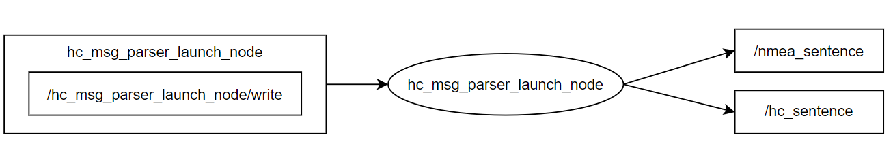


#### 5.1.1-订阅话题

`write` ：节点的私有话题，在接收 `tcp/串口` 信息建立连接的同时，会监听该话题，其余程序向该话题发布的信息将会通过 `tcp/串口` 写入给 `CGI设备`。

- 数据类型 `chcnav/int8_array`

```shell
int8[] data     # 二进制数据，长度可以使用 data.size() 查看
```


#### 5.1.2-发布话题

`/nmea_sentence` ：公共话题，该节点发布 `tcp/串口` 接收到的 `NMEA` 语句，语句通过校验。包含校验位，不包含末尾的 `\r\n`。

- 数据类型 `chcnav/string`

```shell
Header header       # header
string sentence     # nmea 协议语句
```


`/hc_sentence` ：公共话题，该节点发布 `tcp/串口` 接收到的 `hc_protocol` 的二进制串，**未经过** CRC32校验。

- 数据类型 `chcnav/hc_sentence`

```shell
Header header   # header
int16  msg_id   # 协议id，虽然可以从data中解析，但在此处声明更方便后续处理
int8[] data     # hc 协议语句(二进制串) 长度可以使用 data.size() 查看
```


#### 5.1.3-launch参数

该节点可以配置成 `串口`  数据解析节点，也可以配置成 `tcp` 数据解析节点，配置成两个节点所需的参数不同。


**串口解析节点**

| 参数名     | 类型   | 默认值 | 描述                                          |
| ---------- | ------ | ------ | --------------------------------------------- |
| `type`     | string | 无     | 配置成串口时，填写 `serial`                   |
| `rate`     | int    | 1000   | 每秒处理协议的最大数量                        |
| `port`     | string | 无     | linux系统下串口路径                           |
| `baudrate` | int    | 115200 | 串口波特率                                    |
| `databits` | int    | 8      | 串口数据位（通常使用默认值）                  |
| `stopbits` | int    | 1      | 串口停止位（通常使用默认值）                  |
| `parity`   | string | None   | 串口校验位（None/Odd/Even）（通常使用默认值） |


**tcp解析节点**

| 参数名 | 类型   | 默认值 | 描述                        |
| ------ | ------ | ------ | --------------------------- |
| `type` | string | 无     | 配置成 `tcp` 时，填写 `tcp` |
| `rate` | int    | 1000   | 每秒处理协议的最大数量      |
| `host` | string | 无     | IP地址                      |
| `port` | int    | 无     | 端口号                      |


**udp解析节点**

| 参数名 | 类型   | 默认值 | 描述                        |
| ------ | ------ | ------ | --------------------------- |
| `type` | string | 无     | 配置成 `udp` 时，填写 `udp` |
| `rate` | int    | 1000   | 每秒处理协议的最大数量      |
| `host` | string | 无     | IP地址                      |
| `port` | int    | 无     | 端口号                      |


### 5.2-hc_cgi_protocol_process_node

`华测CGI自定义协议` 处理节点，该节点处理原始的二进制 `华测CGI自定义协议` ，并将 `HCINSPVATZCB` 处理后发布到 `devpvt` 话题中；将 `HCRAWIMUIB` 处理后发布到 `devimu` 话题中。


#### 5.2.1-订阅话题

`/hc_sentence` ：由 `hc_msg_parser_launch_node` 发布的公共话题，该话题发布 `hc_protocol` 的二进制串，**未经过** CRC32校验。

- 数据类型 `chcnav/hc_sentence`

```shell
Header header   # header
int16  msg_id   # 协议id，虽然可以从data中解析，但在此处声明更方便后续处理
int8[] data     # hc 协议语句(二进制串) 长度可以使用 data.size() 查看
```


#### 5.2.2-发布话题

`devpvt`：公共话题，是二进制协议 `HCINSPVATZCB` 处理后的信息。该信息中 `header.stamp` 时间戳使用的不是系统时间，是原始二进制协议中的 `gps时间` 。

- 数据类型  `chcnav/hcinspvatzcb`

```shell
std_msgs/Header header

uint16 week                                                 # gps 周
float64 second                                              # gps 周内秒
float64 latitude                                            # 纬度(deg)
float64 longitude                                           # 经度(deg)
float32 altitude                                            # 海拔(m)
float32[3] position_stdev                                   # 位置标准差 [0]lat [1]lon [2]alt   (m)
float32 undulation                                          # 高程异常

float32 roll                                                # 翻滚角(deg)
float32 pitch                                               # 俯仰角(deg)
float32 yaw                                                 # 航向角(deg)  车体坐标系下双天线航向角，取值范围 [-180, +180]，遵循右手定则，逆时针为正。
float32[3] euler_stdev                                      # 欧拉角标准差 [0]roll [1]pitch [2]yaw   (deg)

float32 speed                                               # 地面速度
float32 heading                                             # 航迹角  为车体坐标系下速度航向角，也称航迹角。取值范围 [0, 360] ，顺时针为正。
float32 heading2                                            # 航向角  为车体坐标系下双天线航向角，取值范围 [0, 360] ，顺时针为正。

geometry_msgs/Vector3 enu_velocity                          # 东北天速度 [0]e 东 [1]n 北 [2]u 天 (m/s)
float32[3] enu_velocity_stdev                               # 东北天速度标准差 [0]e 东 [1]n 北 [2]u 天 (m/s)

geometry_msgs/Vector3 vehicle_angular_velocity              # 车辆 xyz 角速度 (deg/s)
geometry_msgs/Vector3 vehicle_linear_velocity               # 车辆 xyz 速度 (m/s)
geometry_msgs/Vector3 vehicle_linear_acceleration           # 车辆 xyz 加速度 有重力 (m/s2)
geometry_msgs/Vector3 vehicle_linear_acceleration_without_g # 车辆 xyz 加速度，无重力

geometry_msgs/Vector3 raw_angular_velocity                  # 设备原始 xyz 角速度 (deg/s)
geometry_msgs/Vector3 raw_acceleration                      # 设备原始 xyz 加速度 有重力

# 状态 
# stat[0] 组合状态 
#           0-初始化
#           1-卫导模式
#           2-组合导航模式
#           3-纯惯导模式    
# stat[1] GNSS状态
#           0-不定位不定向 
#           1-单点定位定向
#           2-伪距差分定位定向
#           3-组合推算
#           4-RTK 稳定解定位定向
#           5-RTK浮点解定位定向
#           6-单点定位不定向
#           7-伪距差分定位不定向
#           8-RTK稳定解定位不定向
#           9-RTK浮点解定位不定向
uint8[2] stat
float32 age                                                 # 差分龄期 s

uint16 ns                                                    # 主天线可见卫星颗数
uint16 ns2                                                   # 辅天线可见卫星颗数
uint16 leaps                                                 # 闰秒 s

float32 hdop                                                # 水平精度因子
float32 pdop                                                # 位置精度因子
float32 vdop                                                # 垂直精度因子
float32 tdop                                                # 种差精度因子
float32 gdop                                                # 几何精度因子

geometry_msgs/Vector3 ins2gnss_vector                       # 设备到天线位置，车辆坐标系下，x/y/z 轴杆臂，m 
geometry_msgs/Vector3 ins2body_angle                        # 车辆坐标系到设备坐标系旋转欧拉角，Z-X-Y顺序旋转，deg 
geometry_msgs/Vector3 gnss2body_vector                      # 天线到后轮中心位置，车辆坐标系下，x/y/z 轴杆臂。m
float32 gnss2body_angle_z                                   # 车辆朝向到GNSS定向方向旋转角，沿车辆坐标系Z轴旋转，deg


uint16 warning                                               # 异常标识
uint16 sensor_used                                           # 传感器使用标识
uint8[16] receiver                                           # 预留
```


`devimu`：公共话题，是二进制协议 `HCRAWIMUB` 处理后的信息。该信息中 `header.stamp` 时间戳使用的不是系统时间，是原始二进制协议中的 `gps时间` 。

- 数据类型  `chcnav/hcrawimub`

```shell
std_msgs/Header header

uint16 week                                             # gps 周
float64 second                                          # gps 周内秒

geometry_msgs/Vector3 angular_velocity                  # 设备原始 xyz 角速度 (deg/s)/Vector3 vehicle_angular_velocity              # 车辆 xyz 角速度 (deg/s)
geometry_msgs/Vector3 angular_acceleration              # 设备原始 xyz 角加速度 有重力
float32 temp                                            # IMU温度（摄氏度）
int8 err_status                                         # 状态异常标识
int16 yaw                                               # Z轴陀螺积分航向, 180~180 系数 0.01
int8 receiver                                           # 预留
```


#### 5.1.3-launch参数

该节点无所需参数，直接声明即可启用节点。

```xml
<node pkg="chcnav" type="hc_cgi_protocol_process_node" name="hc_topic_driver" output="screen"/>
```


### 5.3-ntrip_server

#### 5.3.1-订阅话题

`ntrip_source`：就是发布 GGA 协议的话题，可以使用 `/nmea_sentence` 重定向。

- 数据类型：`/chcnav/string`

```shell
Header header       # header
string sentence     # nmea 协议语句
```


#### 5.3.2-发布话题

`differential_data`：服务器返回的差分数据。需要重定向到能够写入设备的话题。

- 数据类型：`/chcnav/int8_array`

```shell
int8[] data     # 二进制数据，长度可以使用 data.size() 查看
```


#### launch参数

需要根据支持的三种登陆类型配置。


##### 账号密码登录

| 参数名       | 类型   | 值                                | 描述                                   |
| ------------ | ------ | --------------------------------- | -------------------------------------- |
| `login_type` | string | `user_password`                   | 登陆类型                               |
| `frame_id`   | string | `frame_id`                        | 要发送给服务器的`GGA` 消息的`frame_id` |
| `username`   | string | `your_username`                   | 账户                                   |
| `password`   | string | `your_password`                   | 密码                                   |
| `snkey`      | string | `your_snkey`                      | snkey                                  |
| `app_id`     | string | `your_appid`                      | app_id                                 |
| `coordinate` | string | `CGCS2000` or `ITRF14` or `WGS84` | 坐标系选择，三选一                     |

##### Sn snkey登录

| 参数名       | 类型   | 值                                | 描述                                   |
| ------------ | ------ | --------------------------------- | -------------------------------------- |
| `login_type` | string | `sn_device`                       | 登陆类型                               |
| `frame_id`   | string | `frame_id`                        | 要发送给服务器的`GGA` 消息的`frame_id` |
| `sn`         | string | `your_sn`                         | SN号                                   |
| `snkey`      | string | `your_snkey`                      | snkey                                  |
| `app_id`     | string | `your_appid`                      | app_id                                 |
| `coordinate` | string | `CGCS2000` or `ITRF14` or `WGS84` | 坐标系选择，三选一                     |

##### 第三方CORS

| 参数名       | 类型   | 值              | 描述                                   |
| ------------ | ------ | --------------- | -------------------------------------- |
| `login_type` | string | `third_cors`    | 登陆类型                               |
| `frame_id`   | string | `frame_id`      | 要发送给服务器的`GGA` 消息的`frame_id` |
| `host`       | string | `host/ip`       | 第三方CORS服务器地址                   |
| `port`       | string | `port`          | 第三方CORS服务器端口号                 |
| `mountpoint` | string | `mountpoint`    | 挂载点                                 |
| `username`   | string | `your_username` | 账户                                   |
| `password`   | string | `your_password` | 密码                                   |


## 6-算法设计

### 6.1 hc_msg_parser算法

该库路径为 `src/hc_msg_parser_node/hc_msg_parser` ，使用 `有限自动机` 算法，状态图如下：

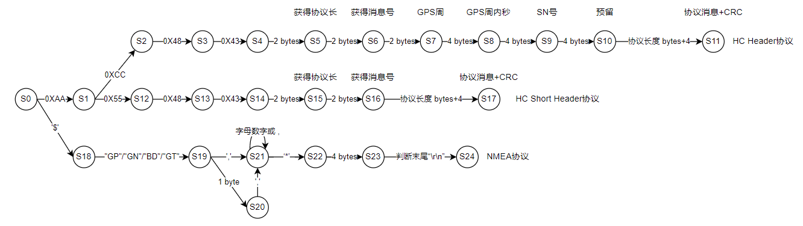

### 6.2 `devpvt` 消息时间戳

`devpvt` 消息中 `header` 中的时间戳使用的是原始二进制协议数据中的 `gps时间`。转换算法如下：


1. ROS时间戳`ros::Time::now()`获取的是自`1970年1月1日0时`到现在时刻的秒数。

2. GPS时间起点是`1980年1月6日0时`，格式为 `GPS周+GPS周内秒`。

3. 计算起点时间秒差：

   ```shell
   # 计算原理: (1980年1月6日0时-1970年1月1日0时)(单位 s) - 18 s (自1980年1月6日0时到2016年的18次闰秒)
   #
   # 计算方式: 先将两个时间起点转换为 Unix 时间戳, 工具网址 https://www.w3cschool.cn/tools/index?name=timestamptrans
   # 然后计算时间戳的差。工具中使用的是北京时间，与Unix时间戳相差八小时，但两者的差结果一致。
   
   315936000-(-28800) - 18 = 315964800 - 18.0
   ```

4. 将 `gps时间` 转换为 `ros时间`

   ```shell
   # 计算原理:  GPS周 * 7(天) * 24(小时/天) * 3600(秒/小时) + GPS周内秒 + 起点秒数差
   
   (gps_week * 7.0 * 24.0 * 3600.0 + gps_seconds) + (315964800.0 - 18.0);
   ```

   

5. 代码实例

   `src/hc_cgi_protocol_process_node.cpp` `msg_deal__hcinspvatzcb函数中`

   ```c++
   devpvt.header.stamp = ros::Time(*((unsigned short *)(&msg->data[22])) * 7.0 * 24.0 * 3600.0 + *((double *)(&msg->data[24])) + 315964800.0 - 18.0);
   ```


## 7-数据时间均匀度测试

### 7.1-测试原理

计算相邻两条 `ros话题消息` 的时间差，挂机一段时间后得到一个时间差数组，将该数组绘图，并标注取最大、最小、平均值。


### 7.2-测试步骤

```shell
# 1.运行测试节点
# roslaunch chcnav demo_7.launch # 记录串口数据
# roslaunch chcnav demo_8.launch # 记录tcp数据

# 2.挂机任意一段时间

# 3.中断程序
ctrl + C

# 4.查看记录文件
# 在ros项目的 devel/lib/chcnav/***_time_record 文件内

# 5.运行python绘图脚本
# python 脚本路径在 src/chcnav_ros/scripts/uniformity_process.py.
# 该文件标注的 python 版本为 3.6（该版本可自行修改），需要 numpy, matplotlib 依赖库，
# 运行方式 uniformity_process.py 接文件路径

cd src/chcnav_ros/scripts
./uniformity_process.py ../../../devel/lib/chcnav/devpvt_time_record

# 6.结果为 devel/lib/chcnav/***_time_record.jpg 图片
```


下图为一个测试结果示例：

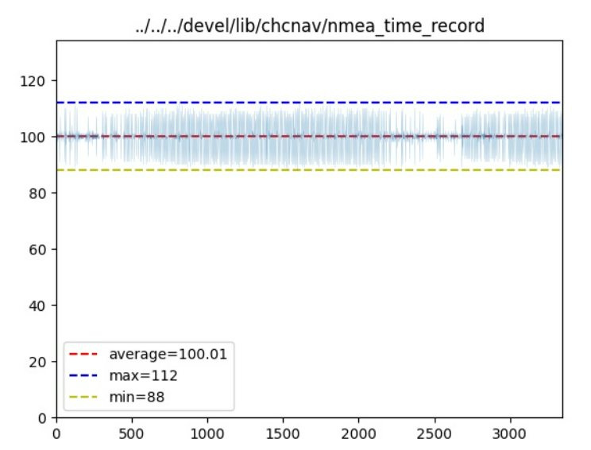

`average`: 记录了两条信息时间差的平均值（ms）。 `1000/average` 则得到消息发布频率。

`max`: 记录了两条信息时间差的最大值（ms）

`min`: 记录了两条信息时间差的最小值（ms）


### 7.3-结果分析

- `hc_time_record` 文件记录了 `/hc_sentence` 话题的每条信息发布的时间。
- `nmea_time_record` 文件记录了 `/nmea_sentence` 话题的每条信息发布的时间。

影响这两个话题消息的时间均匀度因素有：

1. `tcp` 接收时的网络延迟
2. `串口`接收时的 `read` 系统调用延时。
3. `数据传输过程中` 的异常导致校验错误，使消息被抛弃，未发布。 （通常发生在串口接收数据时）


- `devpvt_time_record`文件记录了 `/devpvt` 话题中每条信息的 `header时间戳`（实际上是`gps`时间）
- `devimu_time_record`文件记录了 `/devimu` 话题中每条信息的 `header时间戳`（实际上是`gps`时间）

影响这两个话题消息的时间均匀度因素有：

1. `数据传输过程中` 的异常导致校验错误，使消息被抛弃，未发布。
2. 丢包等其他情况。

因为这两个话题中的时间是原始二进制中的 `gps时间` ，不受传输、读取耗时的影响。

如果分析图片结果中，`averger、max、min` 三者值相等则说明传输过程中无 `丢包`、`校验失败` 等情况发送。


### 7.4-丢包情况

串口收发时，可能遇到接触不稳定导致的数据错误，从而使校验失败放弃数据包。

如下图为一次丢包情况的图片分析结果：

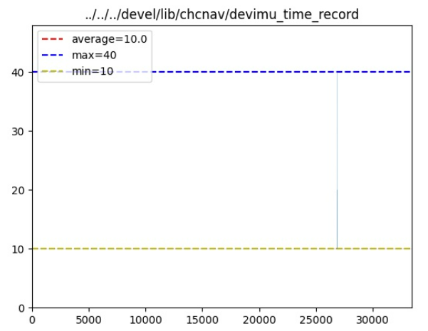

可以得到，丢包发生 `1次`（数波峰数量），丢包数量为（`(40-10)/10=3`包）。

丢包情况只可从 `devpvt_time_record` 、`devimu_time_record` 这两个文件的分析结果中得到。（因为这两个话题时间记录的是 `gps时间`）

### 7.5-串口时间均匀度问题

当串口频率较高时（100hz），串口实际工作频率受系统 `latency_timer` 限制。（详情见 `https://blog.csdn.net/bluewhalerobot/article/details/79147278`）


```shell
1.手动设置latency_timer的值
# 先查看当前值
cat /sys/bus/usb-serial/devices/ttyUSB0/latency_timer

#设置为最小值 1 ms 
sudo chmod 0666 /sys/bus/usb-serial/devices/ttyUSB0/latency_timer
echo 1 > /sys/bus/usb-serial/devices/ttyUSB0/latency_timer

#重启串口程序，应该就有效果了
```


将 `latency_timer` 修改为 `1` 后能够一定程度上的提升时间均匀度。


## 8-demo说明

`ros功能包` 中的 `demo` 包含 `demo_xxx.launch` 文件以及 `src/demo` 文件夹内源码。


- `launch` 文件夹中的 `launch文件`为配置节点 `launch参数` 的演示。

-  `src/demo` 为节点 `demo` 演示。


其余功能需要自行开发。例如 `demo_9` ，为一个将 `devpvt` 话题信息转换成  `sensor_msgs::Imu` 与 `sensor_msgs::NavSatFix` 数据使用的`demo`。
